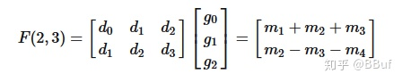
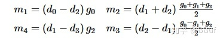
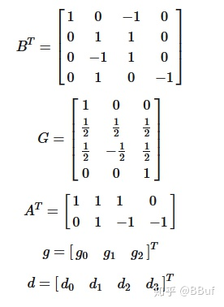
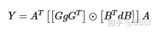
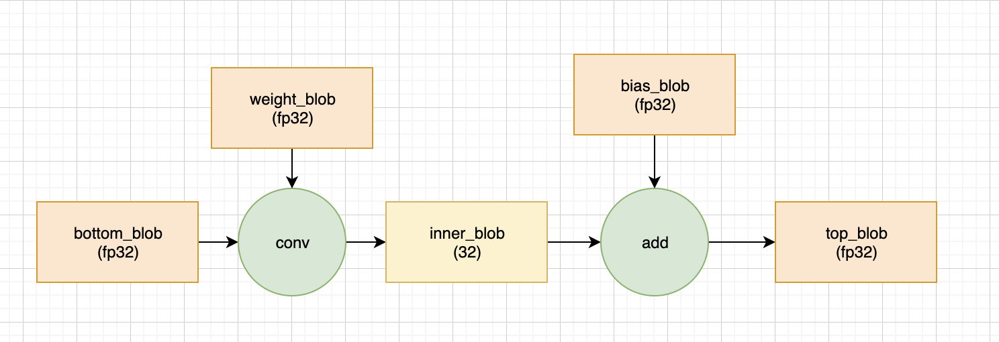
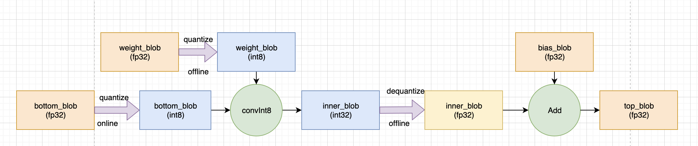

参考 https://polariszhao.github.io/2020/09/17/ncnn%E6%BA%90%E7%A0%81%E5%88%86%E6%9E%90-3/

Extractor有个私有对象ExtractorPrivate

```
//class ExtractorPrivate
public:
    const Net* net;
    std::vector<Mat> blob_mats;
    Option opt;
```

Net里有个私有对象NetPrivate

```
//class NetPrivate
public:
	//不存放具体的计算数据，真正的blob数据存放在blob_mats里
    std::vector<Blob> blobs;
    std::vector<Layer*> layers;
    Option& opt;
```

```
//class Blob
// blob name
std::string name;
// layer index which produce this blob as output
int producer;
// layer index which need this blob as input
int consumer;
// shape hint
Mat shape;
```

## 网络和运算是分开的

```
ncnn的net是网络模型，实际使用的是extractor，
也就是同个net可以有很多个运算实例，而且运算实例互不影响，中间结果保留在extractor内部，
在多线程使用时共用网络的结构和参数数据，初始化网络模型和参数只需要一遍.

举个例子：全局静态的net实例，初始化一次后，就能不停地生成extractor使用.
```

```
[layer type] [layer name] [input count] [output count] [input blobs] [output blobs] [layer specific params]
```

程序局部性
参考 https://zhuanlan.zhihu.com/p/30127242 
https://www.zhihu.com/question/25142664/answer/154497286

pip install onnx -i http://mirrors.aliyun.com/pypi/simple --trusted-host mirrors.aliyun.com

ncnn源码和sse
https://www.cnblogs.com/ttmoon/p/7658212.html
https://github.com/Ewenwan/MVision/blob/master/CNN/HighPerformanceComputing/example/ncnn_%E6%BA%90%E7%A0%81%E5%88%86%E6%9E%90.md

远程服务器docker运行jupyter notebook
https://www.jianshu.com/p/856fcb12a148












pip install onnx -i http://mirrors.aliyun.com/pypi/simple --trusted-host mirrors.aliyun.com

ncnn的conv量化计算流程
正常的 fp32 计算中， 一个conv 的计算流程如下所示， 所有的数据均是 fp32， 没什么特殊的


在 ncnn conv 进行Int8计算时， 计算流程如下所示，
ncnn首先将输入(bottom_blob)和权重量化成Int8，在Int8下计算卷积，
然后反量化到 fp32，再和未量化的bias相加，得到输出 top_blob(ncnn并没有对bias做量化)



ncnn量化方式
weight(带_param_) 
per-channel，求绝对值的最大值，不饱和、对称，不用计算KL散度

blob (不带_param_) 
per-tensor，饱和、对称，通过KL散度计算阈值

```
histogram_interval = max_value / static_cast<float>(num_bins);//width of a bin
int index = std::min(static_cast<int>(std::abs(data_n[i]) / histogram_interval), 2047);
histogram[index]++;
归一化
```

**ncnn2table流程**
```
Input: FP32 histogram H with 2048 bins: bin[ 0 ], …, bin[ 2047 ] 
  
For i in range( 128 , 2048 ):
	t_distribution = [ bin[ 0 ] , ..., bin[ i-1 ] ]
	outliers_count = sum( bin[ i ] , bin[ i+1 ] , … , bin[ 2047 ] ) 
	t_distribution[ i-1 ] += outliers_count
	quantize_distribution = quantize [ bin[ 0 ], …, bin[ i-1 ] ] into 128 levels
	expand_distribution = expand quantize_distribution to ‘ i ’ bins
	divergence[i] = KL_divergence(t_distribution, expand_distribution)
End For
//找出divergence中的最小值，假设divergence[m]最小，
//那么|T|=( m + 0.5 ) * ( width of a bin )
Find index ‘m’ for which divergence[ m ] is minimal
threshold = ( m + 0.5 ) * ( width of a bin )
```
量化参考
https://www.zdaiot.com/MLFrameworks/TensorRT/TensorRT%20INT8%E9%87%8F%E5%8C%96%E5%8E%9F%E7%90%86/

vscode联合调试权限问题解决
echo 0| sudo tee /proc/sys/kernel/yama/ptrace_scope


