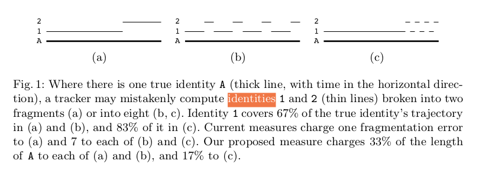

# 一、MOT

#### 基础知识


#### 评价指标

$$
IDP=\frac{IDTP}{IDTP+IDFP};    	
IDR=\frac{IDTP}{IDTP+IDFN};
IDF_1=\frac{2IDTP}{2IDTP+IDFP+IDFN}
$$


$$
MOTA=1-\frac{\Sigma_t(FN_t+FP_t+IDSW_t)}{\Sigma_tGT_t}
$$

$$
MOTP=\frac{\Sigma_{t,i}d_{t,i}}{\Sigma_tc_t}
$$

where c<sub>t</sub> denotes the number of matches in frame t and d<sub>t,i</sub> is the bounding box overlap of target i with
its assigned ground truth object. MOTP thereby gives the average overlap between all correctly matched hypotheses and their respective objects and ranges between t<sub>d</sub> := 50% and 100%. It is important to point out that MOTP is a measure of localization precision.

Each ground truth trajectory can be classified as mostly tracked (**MT**), partially tracked (**PT**), and mostly lost
(**ML**). This is done based on how much of the trajectory is recovered by the tracking algorithm. A target is mostly tracked if it is successfully tracked for at least 80% of its life span. Note that it is irrelevant for this measure whether the ID remains the same throughout the track. If a track is only recovered for less than 20% of its total length, it is said to be mostly lost (ML). All other tracks are partially tracked.

**FM**, 即fragmentation.
$$
FAR=\frac{非同人分数>T}{非同人比较的次数}
$$
FAR(False Accept Rate)来自人脸识别，T是相似度阈值。FAR就是我们比较不同人的图像时，把其中的图像对当成同一个人图像的比例。
$$
F_1=2*\frac{precision*recall}{precision+recall}
$$
F<sub>1</sub> score是precision和recall的调和平均数，最大为1，最小为0。

#### 多目标跟踪模块的评测pipeline

1、准备评测数据集，包含det.txt和gt.txt

2、把det.txt作为多目标跟踪模块的输入，运行多目标跟踪，生成tracking results

3、由tracking results和gt.txt计算得到评测指标

#### 车辆检测模块+车辆跟踪模块的评测pipeline

1、准备评测数据集，包含gt.txt，把评测数据集的ignore区域涂黑

2、把评测数据集图片作为输入，运行车辆检测模块和车辆跟踪模块，生成tracking results

3、由tracking results和gt.txt计算得到评测指标

#### 车辆检测模块+车辆跟踪模块的评测结果

1、评测数据集

http://172.18.192.31:8080/?id=75，总共500张图片，49个car id，fps为3-5。

2、评测代码

https://motchallenge.net/devkit

3、评测结果

 IDF1  IDP  IDR| Rcll  Prcn   FAR |   GT  MT   PT   ML|    FP    FN   IDs    FM |  MOTA  MOTP MOTAL 
 94.1 95.3 93.0| 94.9  97.2  0.21|   49  42    6    1     |   104   193    12    11|  91.9      89.0    92.1 

# 二、reID

#### **ROC曲线**


$$
TPR=\frac{TP}{P};FPR=\frac{FP}{N}
$$
给定阈值T，如果conf>T，则被分为positive，否则被分为negative。一个阈值，得到一组FPR、TPR;设置不同的阈值，得到一系列FPR、TPR。

**四个点：**第一个点，(0,1)，即FPR=0, TPR=1，这意味着FN（false negative）=0，并且FP（false positive）=0。这是一个完美的分类器，它将所有的样本都正确分类。第二个点，(1,0)，即FPR=1，TPR=0，类似地分析可以发现这是一个最糟糕的分类器，因为它成功避开了所有的正确答案。第三个点，(0,0)，即FPR=TPR=0，即FP（false positive）=TP（true positive）=0，可以发现该分类器预测所有的样本都为负样本（negative）。类似的，第四个点（1,1），分类器实际上预测所有的样本都为正样本。经过以上的分析，ROC曲线越接近左上角，该分类器的性能越好。

考虑ROC曲线图中的虚线y=x上的点。这条对角线上的点其实表示的是一个采用随机猜测策略的分类器的结果，例如(0.5,0.5)，表示该分类器随机对于一半的样本猜测其为正样本，另外一半的样本为负样本。

有了ROC曲线后，可以引出AUC的含义：ROC曲线下的面积（越大越好，1为理想状态）。

#### rank-k

算法返回的排序列表中，前k位为存在检索目标则称为rank-k命中。eg：rank1：首位为检索目标则rank-1命中。

#### mAP

反应检索的人在数据库中所有正确的图片排在排序列表前面的程度，能更加全面的衡量ReID算法的性能。如下图，该检索行人在gallery中有4张图片，在检索的list中位置分别为1、2、5、7，则ap为(1 / 1 + 2 / 2 + 3 / 5 + 4 / 7) / 4 =0.793；ap较大时，该行人的检索结果都相对靠前，对所有query的ap取平均值得到mAP。

#### CMC


#### Market1501

**命名规则**
以 0001_c1s1_000151_01.jpg 为例
1） 0001 表示每个人的标签编号，从0001到1501；
2） c1 表示第一个摄像头(camera1)，共有6个摄像头；
3） s1 表示第一个录像片段(sequece1)，每个摄像机都有数个录像段；
4） 000151 表示 c1s1 的第000151帧图片，视频帧率25fps；
5） 01 表示 c1s1_001051 这一帧上的第1个检测框，由于采用DPM检测器，对于每一帧上的行人可能会框出好几个bbox。00 表示手工标注框。

bounding_box_test数据集person id有-1和0000。代码里的注释：-1表示junk images，0000表示background；数据集解释：前缀为 0000 表示在提取这 750 人的过程中DPM检测错的图（可能与query是同一个人），-1 表示检测出来其他人的图（不在这 750 人中）；

评测时，remove gallery samples that have the same pid and camid with query。

junk images are just ignored。

功能:Given a probe image (query), our task is to search in a gallery (database) for images that contain the same person.

输入:a probe image(query)

输出:排序后的所有gallery samples(根据要查询的图像(query) 到所有gallery samples的距离从小到大排序)。

可视化demo:给几张结果图片展示

如何提取出其中的特征提取网络给车辆跟踪模块使用？

在车辆reID的数据集上训练

# 三、OSNet

论文核心是omni-scale feature learning，为此提出了一个网络结构。


| 算法               | confidence | mAP         |
| ------------------ | ---------- | ----------- |
| yolov3/faster_rcnn | 0.001      | 81.5%/83.1% |
| yolov3/faster_rcnn | 0.05       | 80.2%/82.5% |
| yolov3/faster_rcnn | 0.3        | 77%/81.1%   |
| yolov3/faster_rcnn | 0.5        | 72%/79.8%   |

96.5%   82.5%

85%   81.5%


```
 Average Precision  (AP) @[ IoU=0.50:0.95 | area=   all | maxDets=100 ] = 0.536
 Average Precision  (AP) @[ IoU=0.50      | area=   all | maxDets=100 ] = 0.825
 Average Precision  (AP) @[ IoU=0.75      | area=   all | maxDets=100 ] = 0.630
 Average Precision  (AP) @[ IoU=0.50:0.95 | area= small | maxDets=100 ] = 0.148
 Average Precision  (AP) @[ IoU=0.50:0.95 | area=medium | maxDets=100 ] = 0.562
 Average Precision  (AP) @[ IoU=0.50:0.95 | area= large | maxDets=100 ] = 0.684
 Average Recall     (AR) @[ IoU=0.50:0.95 | area=   all | maxDets=  1 ] = 0.366
 Average Recall     (AR) @[ IoU=0.50:0.95 | area=   all | maxDets= 10 ] = 0.556
 Average Recall     (AR) @[ IoU=0.50:0.95 | area=   all | maxDets=100 ] = 0.586
 Average Recall     (AR) @[ IoU=0.50:0.95 | area= small | maxDets=100 ] = 0.187
 Average Recall     (AR) @[ IoU=0.50:0.95 | area=medium | maxDets=100 ] = 0.621
 Average Recall     (AR) @[ IoU=0.50:0.95 | area= large | maxDets=100 ] = 0.736
```

```
 Average Precision  (AP) @[ IoU=0.50:0.95 | area=   all | maxDets=100 ] = 0.659
 Average Precision  (AP) @[ IoU=0.50      | area=   all | maxDets=100 ] = 0.933
 Average Precision  (AP) @[ IoU=0.75      | area=   all | maxDets=100 ] = 0.803
 Average Precision  (AP) @[ IoU=0.50:0.95 | area= small | maxDets=100 ] = 0.273
 Average Precision  (AP) @[ IoU=0.50:0.95 | area=medium | maxDets=100 ] = 0.679
 Average Precision  (AP) @[ IoU=0.50:0.95 | area= large | maxDets=100 ] = 0.745
 Average Recall     (AR) @[ IoU=0.50:0.95 | area=   all | maxDets=  1 ] = 0.416
 Average Recall     (AR) @[ IoU=0.50:0.95 | area=   all | maxDets= 10 ] = 0.681
 Average Recall     (AR) @[ IoU=0.50:0.95 | area=   all | maxDets=100 ] = 0.709
 Average Recall     (AR) @[ IoU=0.50:0.95 | area= small | maxDets=100 ] = 0.318
 Average Recall     (AR) @[ IoU=0.50:0.95 | area=medium | maxDets=100 ] = 0.731
 Average Recall     (AR) @[ IoU=0.50:0.95 | area= large | maxDets=100 ] = 0.797
```

